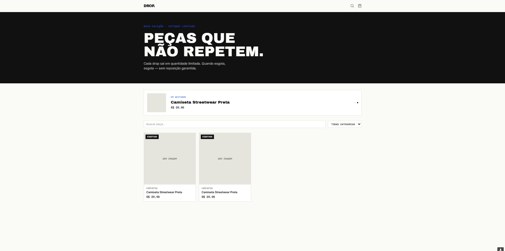
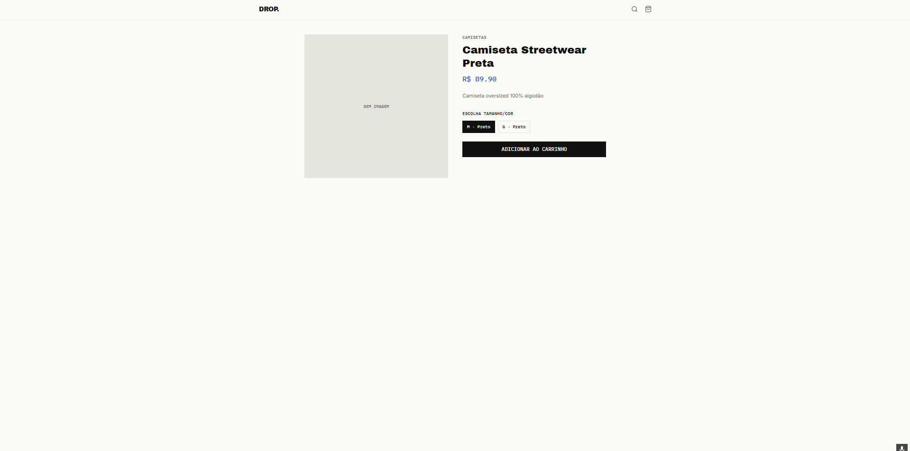
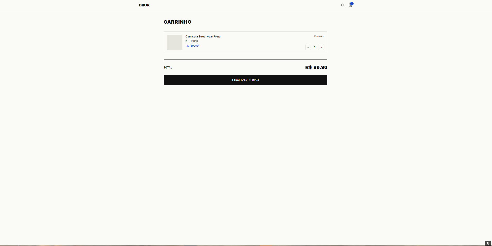

# Marketplace Storefront — Frontend

Loja online (e-commerce) com identidade visual própria, inspirada na cultura de "drop" de streetwear — estoque limitado, contagem regressiva e tags de escassez. Frontend em React consumindo uma API própria com carrinho persistente, checkout via Stripe e painel administrativo com controle de acesso por papel.

🔗 **[Ver loja ao vivo](https://marketplace-fronteeend.vercel.app/login)**
🔗 **[Repositório do backend](https://github.com/lordd123/marketplace-backend)**

## Screenshots

### Vitrine


### Página de produto


### Carrinho e checkout



## Tecnologias

- React + Vite
- Tailwind CSS v4
- React Router
- Axios
- Lucide React (ícones)
- Stripe Checkout (integração via API própria)

## Funcionalidades

- **Vitrine com busca e filtro** por categoria, com carrossel de produtos em destaque
- **Tags de escassez dinâmicas** — mostra "X unidades restantes" quando o estoque de uma variação está baixo, e "esgotado" quando zera
- **Carrinho persistente**, vinculado à conta do usuário (não se perde ao trocar de dispositivo)
- **Checkout real via Stripe**, com redirecionamento para páginas de sucesso e cancelamento
- **Autenticação com dois perfis** (cliente e admin), com o painel administrativo só acessível a quem tem `role: admin`
- **Painel admin completo** para cadastrar produtos, variações (tamanho/cor/estoque) e visualizar o catálogo, sem depender de Postman

## Como rodar localmente

```bash
git clone https://github.com/lordd123/marketplace-frontend.git
cd marketplace-frontend
npm install
```

Cria um `.env`:
```
VITE_API_URL=http://localhost:3000/api
```

```bash
npm run dev
```

> Requer o [backend](https://github.com/lordd123/marketplace-backend) rodando em paralelo.

## Desafios e aprendizados

- **Variáveis de ambiente e build-time vs runtime:** o Vite grava o valor de `VITE_API_URL` dentro do JavaScript compilado no momento do build — não é lido depois, em tempo real. Configurar a variável na Vercel depois de um deploy já feito não tem efeito até um novo build. Isso me ensinou a diferença entre configuração de build e configuração de runtime, algo que passa despercebido até dar errado em produção.

- **Controle de acesso por papel (RBAC) no frontend:** o painel admin só é acessível se o usuário autenticado tiver `role: admin`, verificado tanto na API (o que realmente protege) quanto no frontend (para não mostrar a opção a quem não pode usá-la). O `role` nunca é definido pelo próprio usuário no cadastro — só pode ser promovido diretamente no banco, evitando um problema real de segurança chamado *mass assignment* / escalonamento de privilégio.

- **Sincronização de estado entre componentes:** o contador de itens no ícone do carrinho precisa refletir mudanças feitas em telas diferentes (adicionar no produto, remover no carrinho). Resolvido com Context API do React, centralizando a contagem num único lugar em vez de duplicar lógica em cada componente.

## Projetos relacionados

Esse é o terceiro projeto de um portfólio conectado — construí um SaaS de agendamento, depois uma ferramenta própria de auditoria de segurança, apliquei hardening nesse SaaS usando a ferramenta, e agora esse marketplace aplica os mesmos princípios de segurança (RBAC, prevenção de escalonamento de privilégio) desde o design, não como correção posterior.